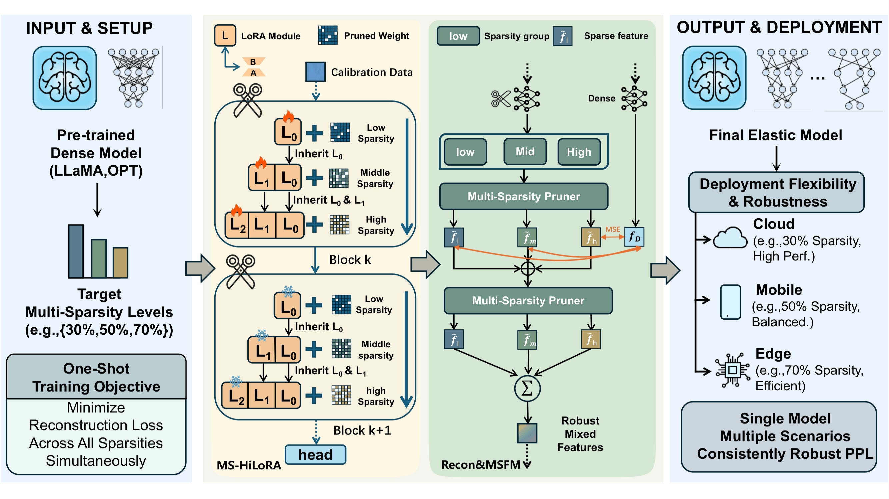

# EPTS: Elastic Post-Training Sparsity for Efficient Large Language Model Compression
[](https://doi.org/10.5281/zenodo.20371703)
## Overview


Overview of our proposed EPTS. Through block-wise reconstruction, EPTS compensates for performance degradation after pruning by fine-tuning LoRA modules L, while the original model weights remain frozen. The reconstruction process consists of two stages: (1) minimizing reconstruction loss across all sparsity groups simultaneously using Multi-Sparsity Hierarchy LoRA. (2) mixing multiple sparsity features across different sparsity groups by Multi-Sparsity Feature Mixer.

---

## Setup
The complete environment dependencies can be found in requirements.txt.

## Quick Start
We provide a streamlined 3-step pipeline to apply the EPTS framework to your Large Language Models.
### Step 1: Precompute Wanda Importance
This step precomputes and caches the Wanda importance scores for all layers. This is required before starting the reconstruction process.

```bash
CUDA_VISIBLE_DEVICES=0,1 python precomputer_wanda_importance.py \
    --model decapoda-research/llama-7b-hf \
    --model_type llama \
    --prune_method wanda \
    --importance_dir "path to save wanda importance"
```

### Step 2: Multi-Sparsity Model Reconstruction
This step performs the block-wise reconstruction of the model across multiple sparsity levels simultaneously, utilizing our proposed MS-HiLoRA and MSFM modules.

```bash
CUDA_VISIBLE_DEVICES=0,1 python main.py \
    --model decapoda-research/llama-7b-hf \
    --model_type llama \
    --prune_method wanda \
    --fusion_level datasets \
    --nsamples 128 \
    --importance_dir "path to save wanda importance" \
    --reconstructed_model_path "Path to save the reconstructed model" 2>&1 | tee output.log
```

### Step 3: Inference with the Pruned Model
Once the model is reconstructed, you can run inference at a specific target sparsity rate (e.g., 70% sparsity) using the saved elastic model.

```bash
CUDA_VISIBLE_DEVICES=0,1 python inference.py \
   --model "decapoda-research/llama-7b-hf" \
   --prune_rate 0.7 \
   --importance_dir "path to save wanda importance" \
   --reconstructed_model_path "Path to save the reconstructed model"
```
